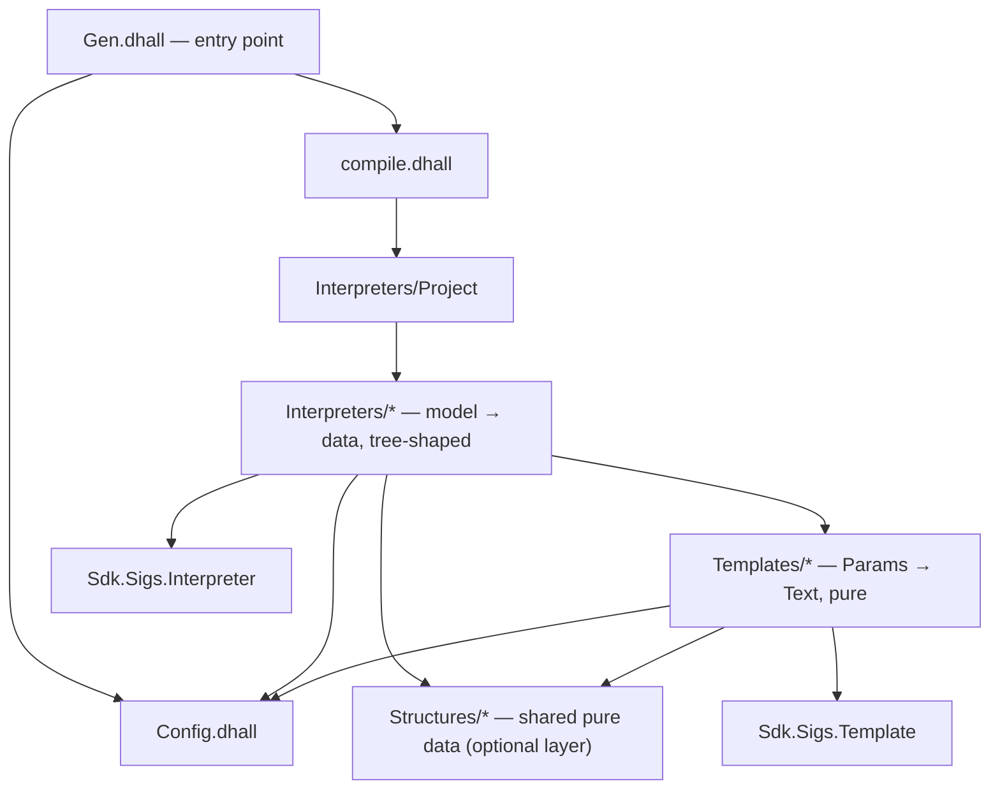
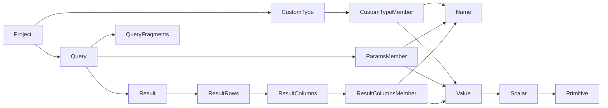

# pGenie Generator Architecture

This document is the normative architecture for pGenie generators — the plugins
that compile a pGenie project (SQL migrations and queries) into an artifact:
a source-code library, its build manifest, its tests, its documentation.

It is written for agents implementing a new generator or extending an existing
one. It prescribes the target architecture; where an existing generator
deviates, the deviation is a defect in that generator, not a licence to copy.

The reference implementation is [java.gen](https://github.com/pgenie-io/java.gen)
([rust.gen](https://github.com/pgenie-io/rust.gen) is a second, leaner instance).

## The big picture

A generator is a pure Dhall program with this type at its core:

```dhall
compile : Optional Config -> Project -> Compiled (List File)
```

- **`Project`** is the input model, defined by this SDK
  ([`dhall/Project.dhall`](../dhall/Project.dhall)): the parsed, analysed
  pGenie project — queries with typed parameters and result columns, custom
  types, migrations, names in all casings.
- **`Config`** is the generator's own user-facing configuration record,
  supplied (optionally) from the pGenie project file.
- **`File`** is `{ path : Text, content : Text }`. Everything a generator
  produces is a file: target-language modules, `pom.xml`/`Cargo.toml`,
  `README.md`, integration tests, CI config. The architecture makes no
  distinction between code and documents — a README is generated by the same
  machinery as a statement class.
- **`Compiled`** is a result type that carries warnings and supports
  skipping unsupported parts of the project with a report instead of failing
  the whole generation. Its contract is specified below.

The computation between `Project` and `List File` is organised as a tree of
**interpreters** that mirrors the shape of the model, with pure **templates**
at the leaves rendering text.



Forbidden edges (enforced by review, not by tooling):

- `Templates → Interpreters` — templates never see the model or its
  interpretation.
- `Templates → Deps.Sdk` — templates never import the Project model.
- `Template → Template` — no inter-template dependencies; only interpreters
  compose templates.

## Anatomy of a generator repository

```
gen/
  Gen.dhall            -- entry point: Sdk.module Config compile
  Config.dhall         -- the generator's user-facing config record type
  compile.dhall        -- Optional Config -> Project -> Compiled (List File)
  InterpreterConfig.dhall -- internal config Type + resolve, threaded through Interpreters
  Deps/                -- pinned remote imports ONLY (one file per dependency)
    Sdk.dhall          -- this SDK (exposes Sdk.Sigs.Interpreter / Sdk.Sigs.Template)
    Prelude.dhall      -- Dhall Prelude
    Lude.dhall         -- lude.dhall (Compiled, File, Text utilities)
    Typeclasses.dhall  -- typeclasses.dhall (Applicative, Alternative, ...)
    package.dhall
  Interpreters/        -- one module per model node kind; forms a tree
  Templates/           -- one module per rendered text fragment or file kind
  Structures/          -- (optional) pure shared data types, e.g. ImportSet
tests/                 -- executable fixtures, e.g. Exhaustive.dhall
demo-output/           -- committed materialisation of a test fixture
```

`Deps/` holds nothing but frozen (`sha256`-pinned) remote imports. Utilities
belong in the layer that owns them, not in a grab-bag directory.

## The two sigs

`Sdk.Sigs` ([`dhall/Sigs/`](../dhall/Sigs)) defines the two module shapes
every generator uses. They are smart constructors for first-class module
records — a poor-man's ML module signature (see the Glossary) — shared by
every generator via this SDK, not copied per-repo.

**Interpreter** (`Sdk.Sigs.Interpreter`, [`dhall/Sigs/Interpreter.dhall`](../dhall/Sigs/Interpreter.dhall)):

```dhall
let module =
      \(Config : Type) ->
      \(Input : Type) ->
      \(Output : Type) ->
        let Result = Compiled Output
        let Run = Config -> Input -> Result
        in  \(run : Run) -> { Input, Output, Result, Run, run }
```

`Config` is supplied by the generator at each call site — it is not the
user-facing `Config.dhall`, but the generator's own internal record (see
`InterpreterConfig.dhall` below), which `compile.dhall` derives from the user
config plus the project (package name, flags, ...) and threads through the
whole tree.

**Template** (`Sdk.Sigs.Template`, [`dhall/Sigs/Template.dhall`](../dhall/Sigs/Template.dhall)):

```dhall
let module =
      \(Params : Type) ->
        let Run = Params -> Text
        in  \(run : Run) -> { Params, Run, run }
```

Every module in `Interpreters/` ends with
`Sdk.Sigs.Interpreter.module InterpreterConfig.Type Input Output run`; every
module in `Templates/` ends with `Sdk.Sigs.Template.module Params run`. No
exceptions — uniformity is what lets an agent open any module and know its
shape.

Each generator defines its own internal config in `gen/InterpreterConfig.dhall`,
exporting a `Type` (the shape threaded through `Interpreters/`) and a
`resolve : Optional Config -> Project -> Type` (the derivation from the
user-facing `Config.dhall` plus project metadata, previously inlined in
`compile.dhall`).

## Interpreters

Interpreters translate the model into target-specific data. Rules:

- **The tree mirrors the model.** One interpreter module per model node kind,
  named after it: `Project`, `Query`, `CustomType`, `ParamsMember`, `Value`,
  `Scalar`, `Primitive`, `Name`. A parent interpreter runs its children with
  the applicative operations of `Compiled` and combines their outputs.
- **`Output` is data, not functions.** An interpreter's `Output` type is a
  record of `Text`, `Bool`, `Optional`, lists, and Structures — never a
  function awaiting more arguments. If a child seems to need a value only the
  parent knows, the parent should pass it down via the child's `Input`, or
  render at the parent level.
- **Render as early as possible.** As soon as an interpreter has all the data
  a template needs, it evaluates the template and puts the resulting `Text`
  in its output. Text flows up; model values do not flow past the interpreter
  that owns them.
- **Names go through a `Name` interpreter.** All identifier rendering —
  casing, reserved-keyword escaping, prefixing — is centralised in
  `Interpreters/Name.dhall`. No ad-hoc identifier munging elsewhere.
- **Context via `nest`.** Each interpreter that corresponds to an addressable
  part of the project wraps its result in `Compiled.nest label`, so every
  report carries the path to its origin (e.g. `queries/selectAlbum/params/3`).
- **Cross-file aggregation happens in the parent.** Content that spans
  children — a README index of statements, a module re-exporting everything —
  is folded from the children's outputs at the parent level (typically
  `Interpreters/Project`). There is no separate "documents" machinery.

The interpreter tree of java.gen, as a representative instance:



## Templates

Templates are pure text functions: `Params -> Text`. Rules:

- **Blind to the model.** A template's `Params` record contains only
  primitives (`Text`, `Bool`, `Optional Text`, `List Text`) and Structures.
  Importing `Deps.Sdk` or anything from `Interpreters/` is forbidden.
- **Independent.** Templates do not call other templates. If two templates
  need to compose, the interpreter composes their outputs.
- **Unindented output, indentation at the splice site.** A template renders
  its content flush-left; the consumer applies
  `Lude.Extensions.Text.indent n` where it splices. This decouples a
  fragment from the indentation depth of every context it lands in.
- **One file-kind or fragment-kind per template.** `StatementModule`,
  `PomXml`, `ReadmeMd`, `ParamField`, ... — the name says what text it makes.

## Structures (optional layer)

A `Structures/` module is a pure, model-agnostic data type with monoid-like
operations (`empty`, `combine`) — for example java.gen's `ImportSet`, which
accumulates which import groups a compilation unit needs. Structures are the
only vocabulary besides primitives that Interpreters and Templates may share.
A generator that needs no such shared type simply has no `Structures/`
directory (rust.gen doesn't).

## The `Compiled` contract

`Compiled` (from [lude.dhall](https://github.com/codemine-io/lude.dhall)) is
the effect wrapper of the whole pipeline:

```dhall
Compiled A = < Ok { warnings : List Report, value : A } | Err Report >
Report     = { path : List Text, message : Text }
```

Operations: `ok`, `err`/`report`/`message` (fail with a report), `map`,
`map2`/`map3`/`ap` and `applicative`, `traverseList`, `alternative` (`or`),
`nest` (prefix a path segment onto all reports), `toFileMap`.

The contract a generator may rely on:

- **Warnings accumulate on the success path.** Applicative composition
  concatenates the warnings of its parts.
- **Errors short-circuit, first error wins.** Within one compilation unit,
  only the first `Err` report is guaranteed to surface; a failed subtree's
  own warnings die with it. Exhaustive error enumeration is not a goal —
  per-unit granularity (below) provides practical completeness.
- **Recovery never loses reports.** `or` (and therefore
  `Alternative.optional`) demotes the failed side's error report into a
  warning on the recovered result. Skipping is always audible.

### The skip protocol

Unsupported input must never produce partial output, and must never fail the
whole generation when it can be excised cleanly:

1. A **leaf** interpreter that meets an unsupported construct fails:
   `Compiled.report Output [ typeName ] "Unsupported type"`.
2. The failure propagates up to the nearest **skippable unit** — a whole
   query or a whole custom type.
3. The unit's parent (`Interpreters/Project`) wraps each unit in
   `Typeclasses.Classes.Alternative.optional`, turning failure into `None`
   plus a warning, and drops the `None`s with `List.unpackOptionals`.
4. A custom type that fails takes down every statement referencing it, by the
   same mechanism.

### How reports reach the user

`Compiled.toFileMap` materialises diagnostics as output files: warnings are
rendered into `warnings.yaml` next to the generated tree; a top-level failure
produces a sole `error.yaml`. Diagnostics are just more Files.

## Entry and distribution contract

`Gen.dhall` is one line:

```dhall
let Sdk = ./Deps/Sdk.dhall in Sdk.module ./Config.dhall ./compile.dhall
```

`Sdk.module` ([`dhall/module.dhall`](../dhall/module.dhall)) stamps the SDK's
`contractVersion` and returns `{ contractVersion, Config, compile,
compileToFileMap }` — the interface `pgn` consumes.

`compile.dhall` is the only place that sees the user-facing `Config`. It
delegates the resolution of the internal interpreter config to
`InterpreterConfig.resolve` (package name, flags, derived from the user
config and the project metadata) and hands the result to
`Interpreters/Project`.

A generator is **distributed** as a single self-contained file: resolve and
freeze `gen/Gen.dhall` into `resolved.dhall` and attach it to a GitHub
release. Users reference it by URL (optionally with integrity hash) in their
pGenie project file:

```yaml
artifacts:
  java:
    gen: https://github.com/pgenie-io/java.gen/releases/download/vX.Y.Z/resolved.dhall
    config:
      useOptional: true
```

## Testing and verification

- `tests/` holds executable fixtures. Each applies the generator to an SDK
  fixture project ([`dhall/Fixtures/`](../dhall/Fixtures)) via
  `compileToFileMap`:

  ```dhall
  let Gen = ../gen/Gen.dhall
  in  Gen.compileToFileMap (Some { useOptional = True }) Deps.Sdk.Fixtures.Exhaustive
  ```

- Materialise with
  `dhall to-directory-tree --allow-path-separators --file tests/Exhaustive.dhall --output demo-output`.
- **Verify with the target toolchain**: the generated artifact must build and
  its generated tests must pass (`mvn verify`, `cargo test`, ...). Type-checking
  the Dhall is necessary but not sufficient.
- `demo-output/` is committed, so diffs in generated output are reviewable
  alongside the generator change that caused them. Never edit it by hand.
- CI regenerates every fixture and builds the result; the release workflow
  reuses the same check before publishing `resolved.dhall`.

## Implementing a new generator: the recipe

1. **Scaffold** the layout above: `gen/{Gen,Config,compile,InterpreterConfig}.dhall`,
   `gen/{Deps,Interpreters,Templates}/`. Copy `Deps/` from java.gen or
   rust.gen and update pins; every `Interpreters/*.dhall`/`Templates/*.dhall`
   module references `Sdk.Sigs.Interpreter`/`Sdk.Sigs.Template` directly —
   there is no local shape file to copy.
2. **Study the target.** Decide the shape of the generated artifact first —
   ideally as a hand-written design repo (cf. `java.gen-design`): one
   statement module, one custom-type module, manifest, README, one test.
   Templates are extracted from this design, not invented.
3. **Define `Config.dhall`** with the user-facing options (keep it small) and
   write `compile.dhall`: resolve defaults, derive the internal interpreter
   `Config`, delegate to `Interpreters/Project`.
4. **Build the interpreter tree bottom-up**, mirroring
   [`Project.dhall`](../dhall/Project.dhall): `Primitive` (the type-mapping
   table; unsupported types fail here) → `Scalar` → `Value` → `Name` →
   the member interpreters → `Query` and `CustomType` → `Project`.
   Wrap each level in `nest`; make every `Output` plain data.
5. **Extract templates** as each interpreter grows a rendering concern.
   The moment an interpreter concatenates more than a line or two of target
   text, that text belongs in `Templates/`.
6. **Wire the skip protocol**: `Alternative.optional` around each query and
   custom type in `Interpreters/Project`.
7. **Aggregate** the cross-file outputs (README, manifest, shared runtime
   module) in `Interpreters/Project` from the children's outputs.
8. **Add a test fixture** in `tests/` against `Sdk.Fixtures.Exhaustive`,
   commit `demo-output/`, make CI build it with the target toolchain.
9. **Release**: freeze to `resolved.dhall`, publish as a release asset.

## Dhall style rules

- **Interpolation over concatenation**: `"Optional<${t}>"`, never
  `"Optional<" ++ t ++ ">"`.
- **No pointless concatenations**: fold adjacent string literals into one;
  absorb `"\n"` and short suffixes into the neighbouring multiline literal.
- **Indentation at the splice site, never in the fragment**: fragments are
  built flush-left; `Lude.Extensions.Text.indent` is applied where the
  fragment is spliced.
- **Import lists via list operations**: collect imports as `List Text`
  (filter/append conditionally), group into sections separated by blank
  lines, join with `Text.concatSep "\n"` — never per-import `if`-variables.
- Format with `dhall format --transitive`; keep everything type-checkable
  with `dhall type`.

## Glossary

| Term | Operational meaning | Nearest FP analogue |
|---|---|---|
| **Sig** | A smart constructor fixing the record shape (`{Input, Output, Result, Run, run}` or `{Params, Run, run}`) that every module of a layer must have; short for "ML module signature" | ML module signature |
| **Interpreter** | A module translating one model node kind into target-specific data, running children applicatively | Sig of a fold over the model (tagless-final style) |
| **Template** | A pure `Params -> Text` module, blind to the model | Function; text combinator |
| **Structure** | A pure shared data type with `empty`/`combine` | Monoid |
| **Compiled** | `< Ok { warnings, value } | Err Report >` with applicative and alternative composition | Validation/Writer hybrid |
| **Report** | `{ path : List Text, message }`; a warning when generation succeeds, the error when it fails | — |
| **`nest`** | Prefixes a path segment onto every report in a subtree | `local` over the report path |
| **Skippable unit** | The granularity at which unsupported input is excised (query, custom type) | `Alternative.optional` boundary |
| **Model** | The `Project` type in this SDK; the generator's entire input | — |
| **File** | `{ path, content }`; the universal output — code, manifests, docs, tests, diagnostics | — |
